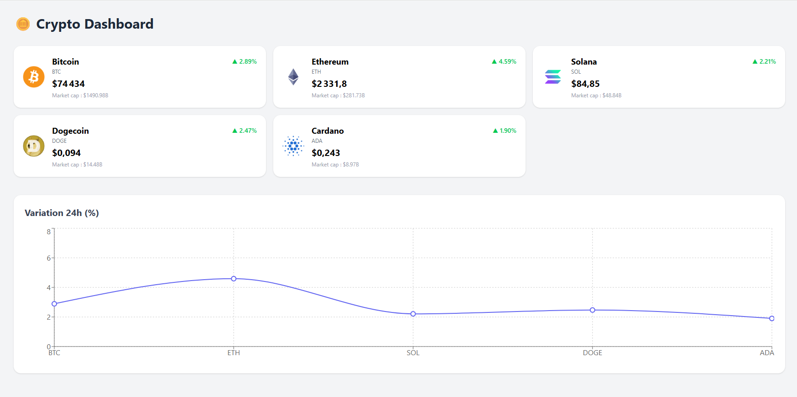

# crypto-dashboard

Un dashboard crypto moderne construit avec React, TypeScript et Vite. Il récupère les prix en temps réel depuis l'API CoinGecko et les affiche sous forme de cartes et de graphiques.

## Stack technique

- **Vite** `^8.0.4` — [vitejs.dev](https://vitejs.dev)
- **React** `^19.2.4` — [react.dev](https://react.dev)
- **TypeScript** `~6.0.2` — [typescriptlang.org](https://www.typescriptlang.org)
- **TanStack Query** `^5.99.0` — [tanstack.com/query/v5](https://tanstack.com/query/v5)
- **Recharts** `^3.8.1` — [recharts.org](https://recharts.org)
- **Tailwind CSS** `^4.2.2` — [tailwindcss.com](https://tailwindcss.com)

## Fonctionnalités

Les différentes fonctionnalités de ce mini site sont :

- l'affichage des prix de crypto en temps réel (rafraîchissement toutes les minutes) ;
- cartes de résumé par actif ;
- graphique d'évolution des prix sur 24 heures ;

## Aperçu

